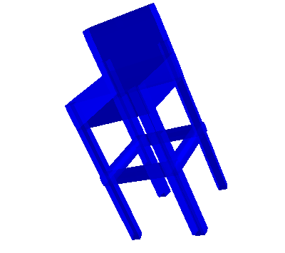

# Marching-Primitives-Python
This is an unofficial version of the python code for Marching-Primitives: Shape Abstraction from Signed Distance Function.

The orignal paper and Matlab version:
> [**Marching-Primitives: Shape Abstraction from Signed Distance Function**](https://arxiv.org/abs/2303.13190 "ArXiv version of the paper.")  
> [Weixiao Liu](https://github.com/bmlklwx)<sup>1,2</sup>, Yuwei Wu<sup>2</sup>, [Sipu Ruan](https://ruansp.github.io/)<sup>2</sup>, [Gregory S. Chirikjian](https://cde.nus.edu.sg/me/staff/chirikjian-gregory-s/)<sup>2</sup>  
> <sup>1</sup> National University of Singapore, <sup>2</sup> Johns Hopkins University
> 
> https://github.com/ChirikjianLab/Marching-Primitives

# Dependency
```
numpy
mayavi
plyfile
scipy
skimage
```

# Usage
The source code of the algorithm is in `MPS.py` and the usage demo is in `main.py`.
For preparing SDF from meshes, you can see the official version.

The visualisation of this code results：



## Citation
If you find this repo useful, please give us a star and cite:
```
@Inproceedings{Liu2023CVPR,
     title = {Marching-Primitives: Shape Abstraction from Signed Distance Function},
     author = {Liu, Weixiao and Wu, Yuwei and Ruan, Sipu and Chirikjian, Gregory},
     booktitle = {Proceedings IEEE Conf. on Computer Vision and Pattern Recognition (CVPR)},
     year = {2023}
}
```
Thanks for your interest!
